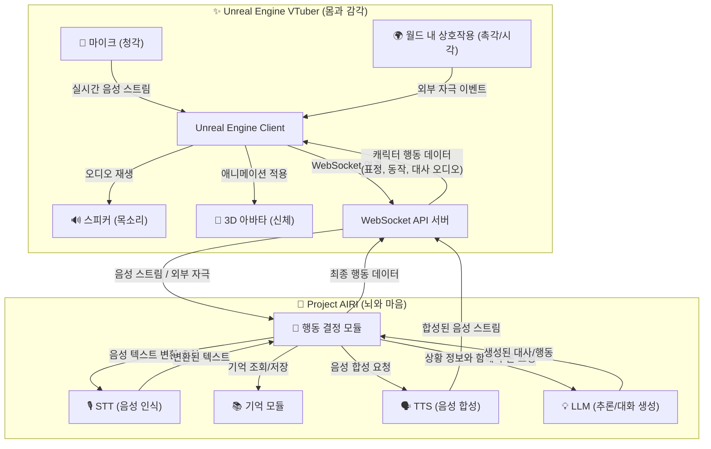

# Unreal Engine VTuber 연동 가이드

이 문서는 Project AIRI의 강력한 AI 기능을 백엔드로 활용하여 Unreal Engine 기반의 버츄얼 유튜버를 개발하는 방법을 안내합니다. 각 팀의 역할을 명확히 하여 효율적인 협업을 돕는 것을 목표로 합니다.

## 1. 프로젝트 개요

본 프로젝트의 목표는 AIRI의 핵심 모듈(기억, 행동, STT, TTS)을 '뇌'로 사용하고, Unreal Engine의 고품질 렌더링 기술을 '몸'으로 사용하여 상호작용이 가능한 AI 버츄얼 유튜버를 구현하는 것입니다.

- **백엔드 (AIRI)**: 사용자의 음성을 인식(STT)하고, 대화를 기억하며(Memory), 외부 자극에 반응하고, 상황에 맞는 대사와 행동을 생성(Behavior)하고, 음성을 합성(TTS)하는 모든 AI 로직을 담당합니다.
- **프론트엔드 (Unreal Engine)**: 사용자의 마이크 입력이나 월드 내 상호작용(자극)을 백엔드로 전송하고, 백엔드로부터 받은 오디오 스트림과 행동 데이터를 바탕으로 3D 아바타를 실시간으로 렌더링하고 애니메이팅하는 역할을 담당합니다.

## 2. 아키텍처

두 시스템은 실시간 통신을 위해 WebSocket API를 통해 연결됩니다. VTuber의 '뇌'는 AIRI 백엔드에 있으며, '몸'은 언리얼 엔진이 담당합니다.



## 3. 상세 모듈 설계 (AIRI 백엔드)

### 3.1. 기억 (Memory) 모듈

캐릭터의 인간적인 상호작용을 위해 단기 기억과 장기 기억으로 나누어 관리합니다.

-   **단기 기억 (Short-Term Memory)**:
    -   **역할**: 현재 대화의 맥락을 유지합니다. (예: 최근 5~10턴의 대화 기록)
    -   **기술**: `Redis` 또는 인메모리 배열(Array)을 사용하여 빠른 접근 속도를 보장합니다.
    -   **활용**: LLM에 프롬프트를 보낼 때, 최근 대화 내용을 함께 전달하여 문맥에 맞는 답변을 생성하도록 합니다.

-   **장기 기억 (Long-Term Memory)**:
    -   **역할**: 사용자에 대한 중요한 정보(이름, 선호도), 과거의 중요한 사건, 캐릭터의 핵심 설정 등을 영구적으로 저장합니다.
    -   **기술**: `pgvector`와 같은 벡터 데이터베이스를 사용합니다. 중요한 정보를 텍스트 임베딩 모델을 통해 벡터로 변환하여 저장하고, 유사도 검색을 통해 관련 기억을 빠르게 찾습니다.
    -   **활용**: 대화 시작 시점이나 특정 키워드가 등장했을 때 관련 기억을 검색하여, LLM 프롬프트에 "당신은 사용자가 커피를 좋아한다는 것을 기억하고 있습니다." 와 같은 추가 정보를 제공합니다.

### 3.2. 행동 (Behavior) 모듈

모든 정보를 종합하여 캐릭터의 최종 행동을 결정하는 중앙 처리 장치입니다.

-   **감정 상태 (Emotional State)**:
    -   캐릭터의 현재 감정(예: `happiness: 0.8`, `surprise: 0.1`)을 수치화된 상태로 관리합니다.
    -   사용자의 대화(긍정/부정), 외부 자극 등에 의해 이 수치는 실시간으로 변동됩니다.
    -   이 감정 상태는 LLM 프롬프트에 반영되어 답변의 톤에 영향을 주고, 최종적으로 언리얼 엔진에 보낼 `action_command`를 결정하는 핵심 기준이 됩니다.

-   **의사 결정 로직**:
    -   LLM에만 의존하지 않는 규칙 기반의 로직을 포함하여, 특정 상황에 대해 더 빠르고 일관된 반응을 생성합니다.
    -   **입력**: STT로 변환된 텍스트, 장기/단기 기억 검색 결과, 언리얼 엔진으로부터의 외부 자극(`world_event`), 현재 감정 상태.
    -   **처리**: 모든 입력 정보를 종합하여 LLM에 보낼 최종 프롬프트를 생성하고, LLM의 답변을 해석합니다.
    -   **출력**: 언리얼 엔진으로 보낼 `action_command`와 TTS 모듈로 보낼 최종 대사 텍스트를 결정합니다.

## 4. API 명세

### 4.1. Unreal Engine -> AIRI

-   **Topic**: `audio_chunk`
    -   **Payload**: `Buffer` (마이크에서 입력된 음성 데이터 조각)
-   **Topic**: `world_event`
    -   **Payload**: `JSON` (월드 내에서 발생한 상호작용 및 자극)
      ```json
      {
        "source": "user_interaction",
        "event_type": "object_given",
        "object_id": "coffee_cup",
        "details": { "temperature": "hot" }
      }
      ```

### 4.2. AIRI -> Unreal Engine

-   **Topic**: `tts_chunk`
    -   **Payload**: `Buffer` (TTS로 합성된 음성 데이터 조각)
-   **Topic**: `action_command`
    -   **Payload**: `JSON`
      ```json
      {
        "type": "emotion",
        "name": "happy",
        "intensity": 0.8,
        "duration_seconds": 3
      }
      ```
      * `type`: 행동의 종류 (`emotion`, `gesture` 등)
      * `name`: 행동의 이름 (`happy`, `wave_hand` 등)
      * `intensity`: 강도 (0.0 ~ 1.0, 표정 등에 사용)
      * `duration_seconds`: 지속 시간 (제스처 등에 사용)

## 5. 개발 범위 및 역할 분담

### 5.1. Unreal Engine 인터페이스 SW (마스터 담당)

AIRI 백엔드와 언리얼 엔진을 연결하고, 수신된 데이터를 처리하여 캐릭터를 제어하는 '중간 다리' 역할을 하는 소프트웨어를 개발합니다. 주로 언리얼 엔진의 **블루프린트(Blueprints)**를 사용하여 구현합니다.

- **WebSocket 클라이언트 구현**:
  - `services/unreal-vtuber`의 WebSocket 서버(`ws://localhost:8080`)에 접속하고 연결을 유지하는 로직을 구현합니다.
- **데이터 처리 및 전송**:
  - **수신**: AIRI로부터 `tts_chunk`와 `action_command` 메시지를 수신하여 각각 오디오 처리, 애니메이션 제어 로직으로 전달합니다.
  - **송신**: 마이크 입력을 `audio_chunk`로, 월드 내 상호작용을 `world_event` JSON으로 변환하여 AIRI 백엔드에 전송합니다.
- **실시간 오디오 처리 (음성 출력 + 립싱크)**:
  - **음성 출력**: 수신된 `tts_chunk` 오디오 데이터를 `Runtime Audio Importer` 플러그인의 `Streaming Sound Wave`에 지속적으로 추가(`Append`)하여 실시간으로 끊김 없이 재생합니다.
  - **립싱크 데이터 전달**: **동일한** 오디오 데이터를 `Runtime MetaHuman Lip Sync` 플러그인의 `Viseme Generator`로 전달하여 실시간 립싱크 애니메이션을 생성하도록 합니다.
- **애니메이션 상태 제어**:
  - 수신된 `action_command` JSON을 파싱하여 **애니메이션 블루프린트**에 미리 정의된 상태 변수(예: `IsHappy` Boolean)의 값을 변경하여 애니메이션을 촉발시킵니다.

### 5.2. 메타휴먼 애니메이션 (애니메이션 팀 담당)

소프트웨어 로직에 의해 제어될 '애니메이션 상태'를 정의하고, 각 상태에 맞는 고품질 애니메이션 리소스를 제작하여 **애니메이션 블루프린트**에 구현합니다. 코드를 작성할 필요 없이, 언리얼 엔진의 비주얼 툴 내에서 작업이 완결됩니다.

- **애니메이션 상태 머신 (State Machine) 구축**:
  - 메타휴먼의 애니메이션 블루프린트 내에 `Idle`(기본 상태)을 중심으로 `Happy`, `Sad`, `WavingHand` 등 다양한 상태를 추가하고, 상태 간의 전환(Transition) 규칙을 SW팀이 제공하는 변수와 연동하여 정의합니다.
- **애니메이션 리소스 제작**:
  - **상태 목록**에 따라 필요한 모든 애니메이션 시퀀스(표정, 제스처 등)를 제작하여 각 상태에 할당합니다.
- **립싱크 노드 연동**:
  - 얼굴 애님 그래프(`Anim Graph`)의 최종 포즈 출력 직전에 `Blend Runtime MetaHuman Lip Sync` 노드를 추가하고, SW팀이 제공할 `VisemeGenerator` 변수를 연결합니다.
- **최종 결과물**:
  - 외부(블루프린트 변수)에서 간단한 값 변경만으로 제어할 수 있는, 모든 애니메이션 로직이 포함된 **애니메이션 블루프린트** 에셋.

---

## 6. 상세 구현 모듈 및 활용 방안

### 6.1. AIRI 백엔드 구현 모듈 (마스터 담당)

AIRI 프로젝트 내에 새로운 서비스로 `unreal-vtuber`를 추가하고, 그 안에 필요한 모듈들을 구현합니다.

| 모듈명 | 예상 경로 | 핵심 역할 및 구현 내용 | 활용 방안 (비개발자용 설명) |
| :--- | :--- | :--- | :--- |
| **WebSocket 서버** | `services/unreal-vtuber/src/server.ts` | Unreal Engine 클라이언트의 접속을 받고, 데이터를 양방향으로 중계하는 통신 허브. | Unreal VTuber의 '귀'와 '입' 역할을 하며 모든 정보가 이 서버를 통해 오고 갑니다. |
| **행동 결정 코어** | `services/unreal-vtuber/src/behavior.ts` | STT, 기억, 감정, 외부 자극 등 모든 정보를 종합하여 최종 행동(`action_command`)과 대사를 결정하는 '뇌'의 중앙 처리 장치. | VTuber의 모든 지능적인 판단과 반응이 이곳에서 이루어집니다. |
| **기억 관리자** | `services/unreal-vtuber/src/memory.ts` | 단기 기억(대화 맥락)과 장기 기억(중요 정보)을 관리. 장기 기억은 벡터 DB와 연동. | "마스터는 커피를 좋아해" 같은 정보를 기억했다가 대화에 활용하여 친밀감을 높입니다. |
| **STT/TTS 핸들러** | `services/unreal-vtuber/src/audio.ts` | 외부 STT/TTS 서비스(예: ElevenLabs)와 통신하여 오디오 스트림을 텍스트로, 텍스트를 오디오 스트림으로 변환. | 마스터의 목소리를 알아듣고, VTuber가 자신의 목소리로 말할 수 있게 해줍니다. |
| **설정 UI 연동** | `apps/stage-tamagotchi/src/pages/settings/modules/unreal-engine.vue` | Unreal VTuber 서비스 활성화 여부, WebSocket 포트 번호 등을 설정할 수 있는 UI 화면. | 하드코딩 없이 Tamagotchi 앱 설정에서 Unreal 연동 기능을 켜고 끌 수 있게 됩니다. |

### 6.2. Unreal Engine 구현 모듈 (마스터 담당, 일부 협업)

언리얼 엔진 내에서 AIRI 백엔드와 통신하고, 캐릭터를 최종적으로 움직이는 로직들을 구현합니다.

| 모듈명 | 구현 위치 | 핵심 역할 및 구현 내용 | 활용 방안 (비개발자용 설명) |
| :--- | :--- | :--- | :--- |
| **설정 및 연결 UI** | UMG 위젯 블루프린트 | AIRI 백엔드의 IP 주소와 포트 번호를 입력하고, 연결을 시작/종료하는 UI 위젯. | VTuber를 켜고 끄는 '리모컨'과 같아요. AIRI라는 '두뇌'가 어디 있는지 알려주는 역할을 합니다. |
| **상태 표시창** | UMG 위젯 블루프린트 | VTuber의 현재 감정 상태(예: `Happiness: 0.8`), 수신된 명령어, 시스템 로그 등을 표시하는 디버깅용 UI. | VTuber의 '마음 상태'를 엿볼 수 있는 창이에요. 지금 기쁜지, 어떤 명령을 받았는지 볼 수 있어 문제 해결에 도움이 됩니다. |
| **WebSocket 통신** | 블루프린트 액터 | 설정 UI의 정보로 WebSocket 서버에 접속. 데이터를 JSON으로 파싱하여 다른 모듈에 전달하는 '통신 안테나'. | AIRI 두뇌로부터 오는 '생각'과 '목소리' 신호를 수신하고, 마스터의 목소리를 두뇌로 보내는 역할을 합니다. |
| **오디오 및 립싱크** | 캐릭터 블루프린트 | `tts_chunk`를 받아 `Runtime Audio Importer`로 재생하고, 동시에 `Runtime MetaHuman Lip Sync`로 입모양을 생성. | '목소리' 신호를 받아 스피커로 소리를 내면서, 그 소리에 맞춰 자연스럽게 입을 움직이게 만드는 모듈입니다. |
| **애니메이션 제어** | 캐릭터 블루프린트 | `action_command`를 받아 애니메이션 블루프린트의 상태 변수를 변경하여 표정/제스처를 제어하는 '신경계'. | '행동' 신호(예: "웃어!")를 받아, 애니메이션 팀이 만든 '근육(애니메이션 블루프린트)'을 움직이게 명령합니다. |

---

## 7. 필요 리소스 목록: 애니메이션 에셋

애니메이션 팀에서 제작해야 할 리소스의 상세 목록입니다.

### 7.1. 표정 (Emotion) - 루핑(Looping) 애니메이션

| 상태 ID | 설명 |
| :--- | :--- |
| `Idle_Normal` | 평상시의 자연스러운 숨쉬기와 눈 깜빡임이 포함된 기본 상태 |
| `Idle_Happy` | 살짝 미소를 띤 기본 상태 |
| `Emotion_Happy` | 기쁨 (활짝 웃는 표정) |
| `Emotion_Excited` | 신남 / 흥분 (눈이 반짝이는 등) |
| `Emotion_Shy` | 부끄러움 / 수줍음 (살짝 얼굴을 붉힘) |
| `Emotion_Sad` | 슬픔 (시무룩한 표정) |
| `Emotion_Angry` | 화남 (눈썹을 찌푸림) |
| `Emotion_Surprised` | 놀람 |
| `Emotion_Thinking` | 생각에 잠김 |

### 7.2. 제스처 (Gesture) - 한 번 재생(One-shot) 애니메이션

| 상태 ID | 설명 |
| :--- | :--- |
| `Gesture_WaveHand` | 손 흔들기 |
| `Gesture_Greeting` | 고개 숙여 인사하기 |
| `Gesture_Nod` | 고개 끄덕이기 (긍정) |
| `Gesture_ShakeHead` | 고개 젓기 (부정) |
| `Gesture_Clap` | 박수치기 |
| `Gesture_Point` | 무언가 가리키기 |
| `Gesture_Heart` | 손으로 하트 만들기 |

### 7.3. 특별 행동 (Special Action) - **핵심 파트**

| 상태 ID | 설명 |
| :--- | :--- |
| `Dance_1` | 댄스 애니메이션 1 |
| `Dance_2` | 댄스 애니메이션 2 |
| `Dance_3` | 댄스 애니메이션 3 |
| `Dance_4` | 댄스 애니메이션 4 |
| `Dance_5` | 댄스 애니메이션 5 |

---

## 8. 개발 로드맵 및 일정 산정

마스터(SW 개발)의 개발 로드맵 및 단계별 예상 기간입니다. 비용 산정을 위해 필요한 리소스(역할)를 함께 명시합니다.

| 단계 | 모듈 | 상세 내용 | 필요 리소스 (역할) | 예상 기간 (주) |
| :--- | :--- | :--- | :--- | :--- |
| **1. 기반 구축** | **WebSocket 서버/클라이언트** | AIRI 백엔드와 언리얼 엔진 간의 기본 통신 채널 구축 | 백엔드 개발자, 언리얼 개발자 | **1** |
| | **실시간 오디오 스트리밍** | 마이크 입력(Unreal->AIRI) 및 TTS 출력(AIRI->Unreal) 스트리밍 구현 | 백엔드 개발자, 언리얼 개발자 | **1** |
| **2. 핵심 AI 기능** | **STT/TTS 모듈 연동** | 백엔드에서 STT/TTS 서비스 API를 호출하고 오디오 데이터를 처리하는 로직 구현 | 백엔드 개발자 | **2** |
| | **단기 기억 (Context) 모듈** | 현재 대화의 맥락을 기억하여 LLM 프롬프트에 포함시키는 기능 구현 | 백엔드 개발자 | **1** |
| | **기본 행동 결정 로직** | STT 결과와 단기 기억을 바탕으로 LLM을 호출하고, 기본 응답 텍스트와 `Idle` 상태를 반환하는 로직 | 백엔드 개발자 | **2** |
| **3. 고도화** | **장기 기억 (Vector DB) 모듈** | 사용자에 대한 중요 정보를 벡터 DB에 저장하고 검색하여 LLM 프롬프트에 반영하는 기능 | 백엔드 개발자 | **3** |
| | **감정 상태 & 외부 자극 처리** | 캐릭터의 내부 감정 상태를 관리하고, 언리얼의 `world_event`에 반응하여 감정 변화 및 행동을 결정하는 로직 | 백엔드 개발자 | **3** |
| | **애니메이션 제어 연동** | 감정 상태 및 LLM 답변을 해석하여, 정의된 애니메이션 목록에 맞는 `action_command`를 언리얼로 전송하는 기능 | 백엔드 개발자, 언리얼 개발자 | **2** |

### 리소스별 총 예상 기간

- **백엔드 개발자 (Node.js/TypeScript)**: 1 + 1 + 2 + 1 + 2 + 3 + 3 + 2 = **15 주**
- **언리얼 개발자 (Blueprints/C++)**: 1 + 1 + 2 = **4 주**

**참고**: 위 일정은 각 모듈을 순차적으로 개발하는 것을 가정하며, 리소스가 동시에 투입될 경우 전체 프로젝트 기간은 단축될 수 있습니다. 예를 들어, 1단계 개발 시 백엔드와 언리얼 개발자가 동시에 작업을 진행할 수 있습니다.

---

## 9. 전체 프로젝트 타임라인

애니메이션 제작 기간을 포함한 전체 프로젝트의 예상 타임라인입니다.

### 9.1. 애니메이션 팀 리소스 예상 기간

| 애니메이션 파트 | 항목 개수 | 항목당 평균 제작 기간 (주) | 예상 기간 (주) |
| :--- | :--- | :--- | :--- |
| **표정 (Emotion)** | 9 개 | 0.5 | **4.5** |
| **제스처 (Gesture)** | 7 개 | 0.5 | **3.5** |
| **특별 행동 (Dance)** | 5 개 | 2 | **10** |
| **총 예상 기간** | | | **약 18 주** |

*참고: 위 기간은 애니메이션의 복잡도, 품질 요구 수준, 팀의 규모에 따라 변동될 수 있습니다.*

### 9.2. 통합 타임라인 (SW 개발 + 애니메이션)

**프로젝트 예상 시작일: 2024년 9월 16일 (월)**

| 단계 (Phase) | 기간 (주) | 주요 작업 (SW 개발) | 주요 작업 (애니메이션) | 예상 완료일 |
| :--- | :--- | :--- | :--- | :--- |
| **1** | 8 | 기반 구축, STT/TTS, 단기 기억, 기본 행동 로직 구현 | 표정 및 제스처 리소스 전체 제작, 1차 통합 테스트 | **11월 8일** |
| **2** | 10 | 장기 기억, 감정 상태, 외부 자극, 애니메이션 제어 등 고도화 | 댄스 애니메이션 5종 전체 제작 | **2025년 1월 17일** |
| **3** | 1 | 최종 통합 및 테스트 | 최종 리소스 전달 및 테스트 | **2025년 1월 24일** |

**프로젝트 주요 기능 구현 예상 완료일: 2025년 1월 24일 (금)**

---

## 10. 인력 리소스 산정 (Man-Month)

프로젝트 예산 계획을 위해 필요한 총 인력 리소스(Man-Month)를 산정합니다.
*1 Man-Month (M/M) = 개발자 1명이 한 달(약 4주) 동안 일하는 양*

### 10.1. SW 개발 (1인 개발 기준)

| 역할 | 총 예상 기간 (주) | Man-Month (M/M) |
| :--- | :--- | :--- |
| **SW 개발 및 PM** | 19 주 | **6.0 M/M** |

*   **설명**: SW 개발자가 개발과 PM 역할을 겸임하는 것을 기준으로 하며, 약 19주의 프로젝트 기간 동안 추가 근무를 포함하여 총 **6.0 M/M**의 공수가 투입되는 것으로 산정합니다.

### 10.2. 애니메이션 제작

| 역할 | 총 예상 기간 (주) | Man-Month (M/M) |
| :--- | :--- | :--- |
| **3D 애니메이터** | 18 주 | **약 4.5 M/M** |

*   **설명**: 1인의 전담 애니메이터가 작업을 수행하는 것을 기준으로 하며, 약 **18주**의 제작 기간, **4.5 M/M**의 제작 공수가 필요합니다. 팀 규모에 따라 기간은 변동될 수 있으나 총 공수는 유사합니다.

---

## 11. 프로젝트 예산 산정

본 프로젝트에 필요한 인력 리소스 공수(Man-Month)를 기반으로, SW기술자 평균임금 통계 및 일반적인 SW사업대가 산정 기준을 적용하여 총 프로젝트 예산을 산정합니다.

*참고 자료: 2024년 SW기술자 평균임금 (한국소프트웨어산업협회)*

### 11.1. SW 개발 기업

| 구분 | 산정 기준 | 예상 비용 |
| :--- | :--- | :--- |
| **직접인건비 (A)** | (IT PM + 응용SW개발자) 평균 단가 `8,044,465원/월` * `6.0 M/M` | **48,266,790** |
| **제경비 (B)** | 직접인건비(A)의 140% | 67,573,506 |
| **기술료 (C)** | (A + B)의 20% | 23,168,059 |
| **소계** | | **139,000,000 원 (약 1억 3천 9백만 원)** |

*   **산정 근거**:
    *   **적용 단가**: IT PM(9,145,473원)과 응용SW개발자(6,943,457원)의 평균 임금을 적용하여, PM 역할을 겸하는 SW 개발자의 가치를 반영.
    *   **필요 공수**: **6.0 M/M** (순수 SW 개발 4.75 M/M + PM 업무 1.25 M/M)

### 11.2. 애니메이션 제작 기업

| 구분 | 산정 기준 | 예상 비용 |
| :--- | :--- | :--- |
| **직접인건비 (A)** | UI/UX기획/개발자 단가 `6,727,260원/월` * `4.5 M/M` | **30,272,670** |
| **제경비 (B)** | 직접인건비(A)의 140% | 42,381,738 |
| **기술료 (C)** | (A + B)의 20% | 14,530,881 |
| **소계** | | **87,200,000 원 (약 8천 7백만 원)** |

*   **산정 근거**:
    *   **적용 단가**: 유사 직군인 UI/UX기획/개발자 단가를 참고용으로 적용. (실제 계약 단가에 따라 변동 가능)
    *   **필요 공수**: **4.5 M/M**

### 11.3. 총 프로젝트 예상 비용

- **합계**: `139,000,000원` + `87,200,000원` = **226,200,000 원 (약 2억 2천 6백만 원)**

*참고: 위 금액은 제시된 자료를 바탕으로 한 추정치이며, 실제 계약 단가, 투입 인력의 등급, 기타 직간접 경비에 따라 변동될 수 있습니다. 예산이 부족할 경우, 제경비와 기술료는 상호 협의를 통해 조정할 수 있는 항목입니다.*
