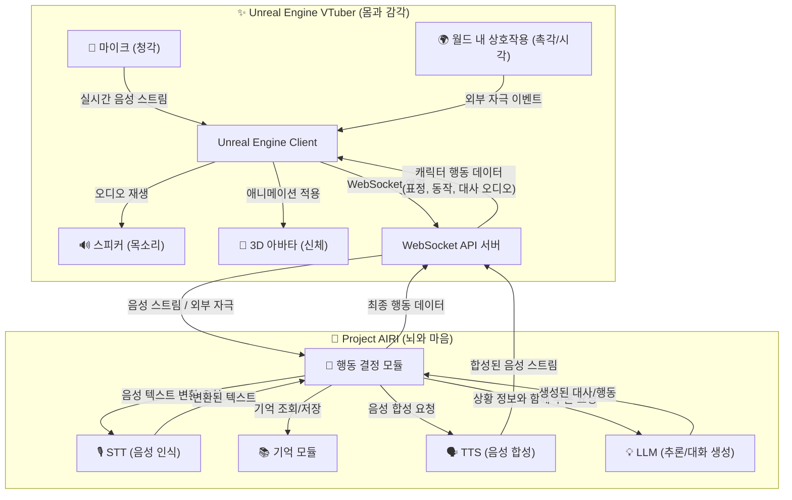

# Unreal Engine VTuber 연동 가이드 및 개발 계획

이 문서는 Project AIRI의 강력한 AI 기능을 백엔드로 활용하여 Unreal Engine 기반의 버츄얼 유튜버를 개발하는 방법을 안내합니다. 아키텍처 설계부터 역할별 책임, 필요 리소스, 개발 일정까지 프로젝트의 모든 것을 포함합니다.

## 1. 프로젝트 개요

본 프로젝트의 목표는 AIRI의 핵심 모듈(기억, 행동, STT, TTS)을 '뇌'로 사용하고, Unreal Engine의 고품질 렌더링 기술을 '몸'으로 사용하여 상호작용이 가능한 AI 버츄얼 유튜버를 구현하는 것입니다.

- **백엔드 (AIRI)**: 사용자의 음성을 인식(STT)하고, 대화를 기억하며(Memory), 외부 자극에 반응하고, 상황에 맞는 대사와 행동을 생성(Behavior)하고, 음성을 합성(TTS)하는 모든 AI 로직을 담당합니다.
- **프론트엔드 (Unreal Engine)**: 사용자의 마이크 입력이나 월드 내 상호작용(자극)을 백엔드로 전송하고, 백엔드로부터 받은 오디오 스트림과 행동 데이터를 바탕으로 3D 아바타를 실시간으로 렌더링하고 애니메이팅하는 역할을 담당합니다.

## 2. 아키텍처

두 시스템은 실시간 통신을 위해 WebSocket API를 통해 연결됩니다. VTuber의 '뇌'는 AIRI 백엔드에 있으며, '몸'은 언리얼 엔진이 담당합니다.

## 3. 상세 모듈 설계 (AIRI 백엔드)

### 3.1. 기억 (Memory) 모듈

캐릭터의 인간적인 상호작용을 위해 단기 기억과 장기 기억으로 나누어 관리합니다.

-   **단기 기억 (Short-Term Memory)**: 현재 대화의 맥락을 유지합니다. (예: 최근 5~10턴의 대화 기록)
-   **장기 기억 (Long-Term Memory)**: 사용자에 대한 중요한 정보, 과거의 사건, 캐릭터의 핵심 설정 등을 영구적으로 저장하고 유사도 기반으로 검색합니다.

### 3.2. 행동 (Behavior) 모듈

모든 정보를 종합하여 캐릭터의 최종 행동을 결정하는 중앙 처리 장치입니다.

-   **감정 상태 (Emotional State)**: 캐릭터의 현재 감정(예: `happiness: 0.8`)을 수치로 관리하며, 대화와 자극에 따라 실시간으로 변화합니다.
-   **의사 결정 로직**: 모든 입력(STT, 기억, 외부 자극, 감정)을 종합하여 LLM 프롬프트를 생성하고, 그 결과를 해석하여 최종 행동과 대사를 결정합니다.

## 4. API 명세

### 4.1. Unreal Engine -> AIRI

-   **Topic**: `audio_chunk` (`Buffer`), `world_event` (`JSON`)

### 4.2. AIRI -> Unreal Engine

-   **Topic**: `tts_chunk` (`Buffer`), `action_command` (`JSON`)

---

## 5. 역할 및 책임 (R&R)

### 5.1. Unreal Engine 인터페이스 SW (마스터 담당)

AIRI 백엔드와 언리얼 엔진을 연결하고, 수신된 데이터를 처리하여 캐릭터를 제어하는 '중간 다리' 역할을 하는 소프트웨어를 개발합니다.

- **주요 기술**: Unreal Engine **블루프린트(Blueprints)**, `Runtime Audio Importer` 및 `Runtime MetaHuman Lip Sync` 플러그인.
- **핵심 책임**:
    1.  WebSocket 통신 클라이언트 구현 (연결, 데이터 송/수신)
    2.  실시간 오디오 처리 (마이크 입력 전송, TTS 출력 및 립싱크 연동)
    3.  `action_command`에 따른 애니메이션 상태 변수 제어
    4.  월드 내 상호작용을 `world_event`로 변환하여 백엔드에 전송

### 5.2. 메타휴먼 애니메이션 (애니메이션 팀 담당)

소프트웨어 로직에 의해 제어될 '애니메이션 상태'를 정의하고, 각 상태에 맞는 고품질 애니메이션 리소스를 제작하여 **애니메이션 블루프린트**에 구현합니다.

- **주요 기술**: Unreal Engine **애니메이션 블루프린트 (상태 머신)**, 3D 애니메이션 툴.
- **핵심 책임**:
    1.  아래 **5.3. 필요 리소스 목록**에 명시된 모든 애니메이션 클립 제작.
    2.  애니메이션 블루프린트 내에 상태 머신을 구축하고, SW팀이 제공하는 변수와 연동하여 상태 전환 규칙 설정.
    3.  립싱크 플러그인 노드를 애님 그래프에 통합.

### 5.3. 필요 리소스 목록: 애니메이션 에셋

애니메이션 팀에서 제작해야 할 리소스의 상세 목록입니다.

#### A. 표정 (Emotion) - 루핑(Looping) 애니메이션

| 상태 ID | 설명 |
| :--- | :--- |
| `Idle_Normal` | 평상시의 자연스러운 숨쉬기와 눈 깜빡임이 포함된 기본 상태 |
| `Idle_Happy` | 살짝 미소를 띤 기본 상태 |
| `Emotion_Happy` | 기쁨 (활짝 웃는 표정) |
| `Emotion_Excited` | 신남 / 흥분 (눈이 반짝이는 등) |
| `Emotion_Shy` | 부끄러움 / 수줍음 (살짝 얼굴을 붉힘) |
| `Emotion_Sad` | 슬픔 (시무룩한 표정) |
| `Emotion_Angry` | 화남 (눈썹을 찌푸림) |
| `Emotion_Surprised` | 놀람 |
| `Emotion_Thinking` | 생각에 잠김 |

#### B. 제스처 (Gesture) - 한 번 재생(One-shot) 애니메이션

| 상태 ID | 설명 |
| :--- | :--- |
| `Gesture_WaveHand` | 손 흔들기 |
| `Gesture_Greeting` | 고개 숙여 인사하기 |
| `Gesture_Nod` | 고개 끄덕이기 (긍정) |
| `Gesture_ShakeHead` | 고개 젓기 (부정) |
| `Gesture_Clap` | 박수치기 |
| `Gesture_Point` | 무언가 가리키기 |
| `Gesture_Heart` | 손으로 하트 만들기 |

#### C. 특별 행동 (Special Action)

| 상태 ID | 설명 |
| :--- | :--- |
| `Dance_1` | 댄스 애니메이션 1 |
| `Dance_2` | 댄스 애니메이션 2 |
| `Dance_...` | (추가 댄스 애니메이션) |

---

## 6. 개발 로드맵 및 일정 산정

마스터(SW 개발)의 개발 로드맵 및 단계별 예상 기간입니다.

| 단계 | 모듈 | 상세 내용 | 예상 기간 |
| :--- | :--- | :--- | :--- |
| **1. 기반 구축** | **WebSocket 서버/클라이언트** | AIRI 백엔드와 언리얼 엔진 간의 기본 통신 채널 구축 | **1 주** |
| | **실시간 오디오 스트리밍** | 마이크 입력(Unreal->AIRI) 및 TTS 출력(AIRI->Unreal) 스트리밍 구현 | **1 주** |
| **2. 핵심 AI 기능** | **STT/TTS 모듈 연동** | 백엔드에서 STT/TTS 서비스 API를 호출하고 오디오 데이터를 처리하는 로직 구현 | **2 주** |
| | **단기 기억 (Context) 모듈** | 현재 대화의 맥락을 기억하여 LLM 프롬프트에 포함시키는 기능 구현 | **1 주** |
| | **기본 행동 결정 로직** | STT 결과와 단기 기억을 바탕으로 LLM을 호출하고, 기본 응답 텍스트와 `Idle` 상태를 반환하는 로직 | **2 주** |
| **3. 고도화** | **장기 기억 (Vector DB) 모듈** | 사용자에 대한 중요 정보를 벡터 DB에 저장하고 검색하여 LLM 프롬프트에 반영하는 기능 | **3 주** |
| | **감정 상태 & 외부 자극 처리** | 캐릭터의 내부 감정 상태를 관리하고, 언리얼의 `world_event`에 반응하여 감정 변화 및 행동을 결정하는 로직 | **3 주** |
| | **애니메이션 제어 연동** | 감정 상태 및 LLM 답변을 해석하여, 정의된 애니메이션 목록에 맞는 `action_command`를 언리얼로 전송하는 기능 | **2 주** |
| | **총 예상 기간** | | **약 15 주** |
